# PocketStore – Catálogo Offline con Vanilla JS

Aplicación web de una sola página (PWA) que muestra un catálogo de usuarios obtenido de la API pública [JSONPlaceholder](https://jsonplaceholder.typicode.com/) y que **funciona completamente sin internet** gracias a un Service Worker y a la caché del navegador.

- **Modalidad:** desarrollo individual
- **Tecnologías:** HTML, CSS y JavaScript puro (sin frameworks)
- **Autor:** _tu nombre aquí_

---

## Estructura del proyecto

```
/pocket-store
│
├── index.html         # Vista (App Shell)
├── styles.css         # Estilos del App Shell
├── app.js             # Lógica de la aplicación y registro del SW
├── sw.js              # Controlador (Service Worker y Caché)
├── manifest.json      # Configuración de instalación (Manifiesto)
├── icons/             # Iconos 192x192 y 512x512
└── images/            # Capturas usadas en esta documentación
```

> 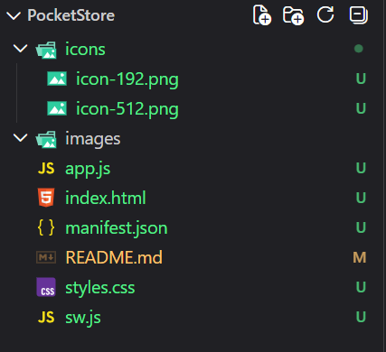

---

## Cómo ejecutarlo

Los Service Workers solo funcionan en `localhost` o HTTPS, por lo que no basta con abrir `index.html` directamente. Desde la carpeta del proyecto, levanta un servidor local:

```bash
# Opción 1: Python
python -m http.server 8080

```

Luego abre `http://localhost:8080`.

> 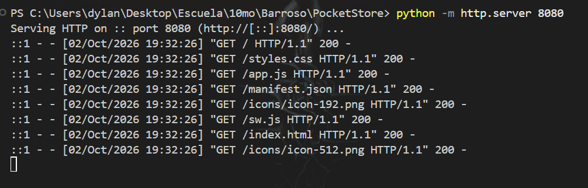
> 

---

## 1. El Manifiesto (`manifest.json`)

Archivo JSON escrito a mano que le dice al navegador cómo instalar la app.

| Propiedad | Valor | Para qué sirve |
|---|---|---|
| `name` | PocketStore - Catálogo Offline | Nombre completo |
| `short_name` | PocketStore  | Nombre bajo el icono |
| `start_url` | `./index.html` | Página que abre la app instalada |
| `display` | `standalone` | Se abre sin barra del navegador |
| `background_color` | `#EAF0F7` | Color de la pantalla de carga |
| `theme_color` | `#1B2A4A` | Color de la barra de estado |
| `icons` | 192x192 y 512x512 | Iconos de instalación |

El manifiesto se enlaza en el `<head>` de `index.html`:

```html
<link rel="manifest" href="manifest.json">
```

> 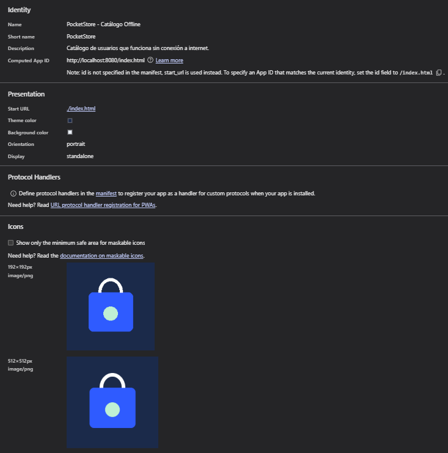

---

## 2. El App Shell (`index.html` y `styles.css`)

El App Shell es la estructura visual fija que carga al instante, antes de que lleguen los datos:

- **Barra superior** con el título y un indicador de conexión (En línea / Sin conexión).
- **Contenedor principal** (`<main id="catalog">`) donde se inserta el contenido dinámico.
- **Pie de página** fijo.

Como solo usa HTML y CSS locales (sin fuentes ni librerías externas), se guarda completo en caché y se muestra aunque no haya red.

> 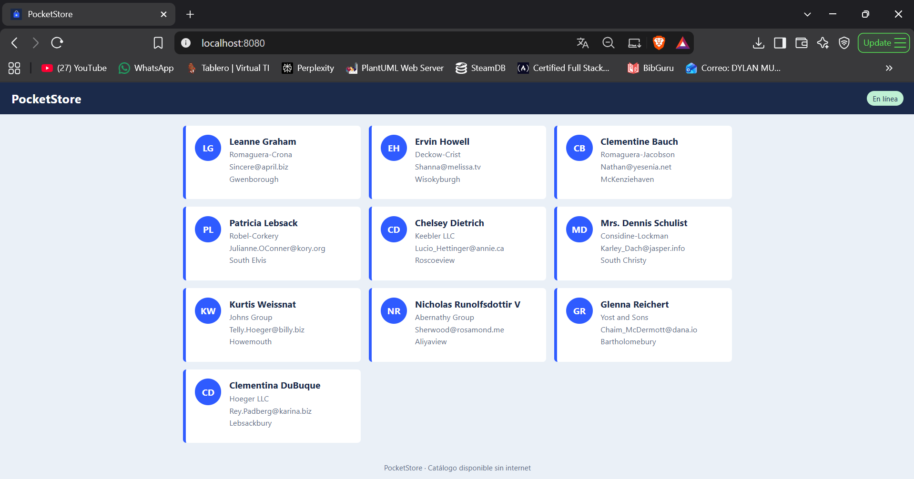

---

## 3. El Service Worker y la Caché (`sw.js`)

Implementa las tres fases del ciclo de vida:

| Evento | Qué hace |
|---|---|
| `install` | Abre la caché `pocketstore-shell-v1` y guarda los archivos del App Shell. |
| `activate` | Elimina cachés de versiones anteriores y toma control de las pestañas abiertas. |
| `fetch` | Intercepta cada petición y decide de dónde responder. |

**Estrategias del evento `fetch`:**

- **Archivos del App Shell → caché primero (*cache-first*).** Si el archivo está guardado se sirve al instante; si no, se pide a la red.
- **API de JSONPlaceholder → red primero (*network-first*).** Se intenta obtener datos frescos y se guarda una copia en `pocketstore-data-v1`; si no hay internet, se responde con la última copia guardada.

> 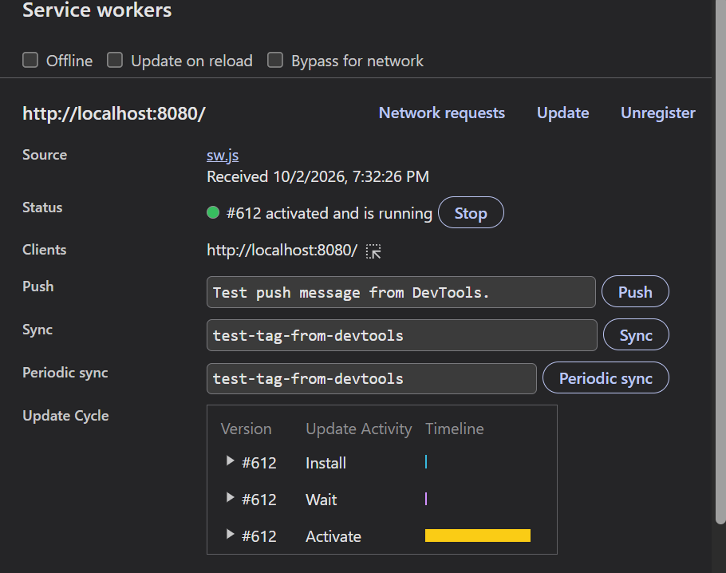

> 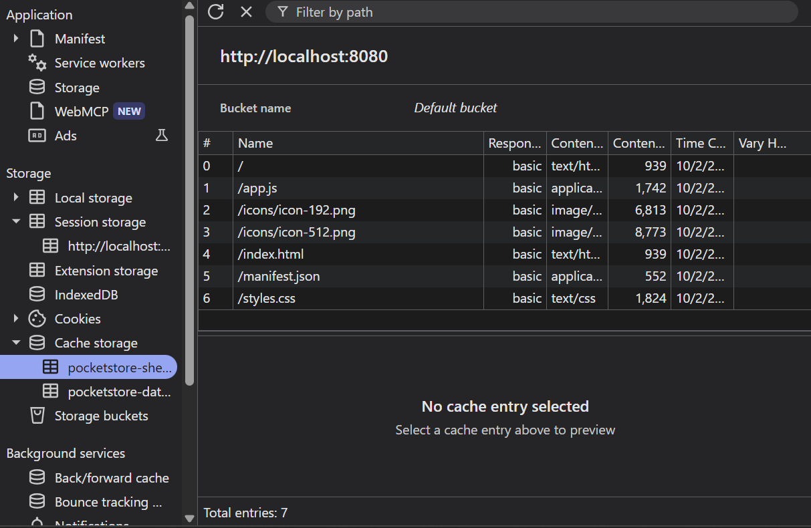
> 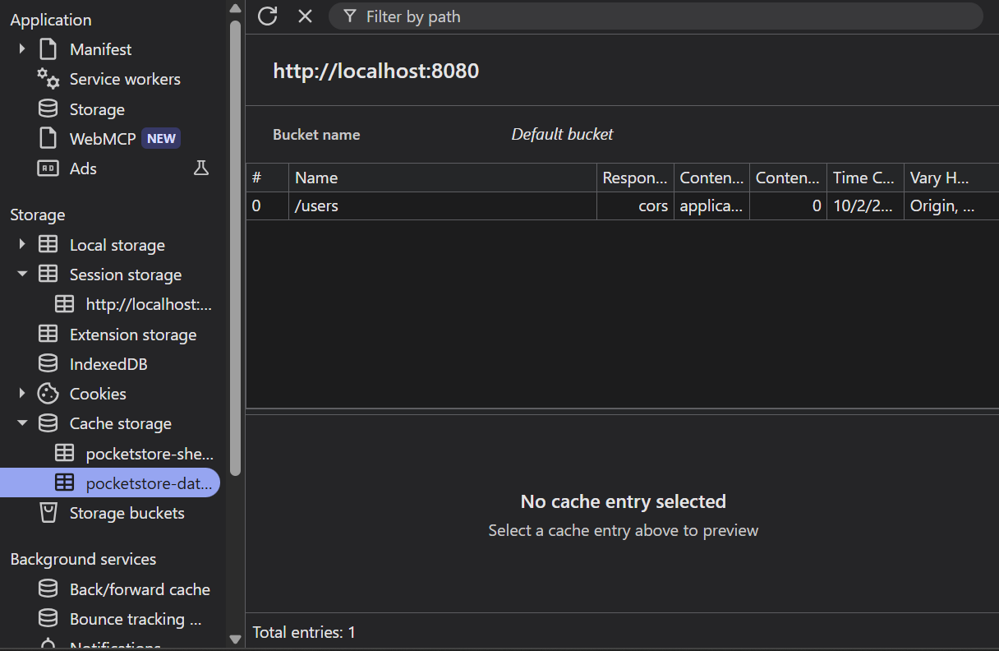

---

## 4. El Contenido Dinámico (`app.js`)

`app.js` hace dos cosas:

1. **Registra el Service Worker** con `navigator.serviceWorker.register('./sw.js')`.
2. **Consume la API** con `fetch()` y pinta una tarjeta por usuario:

```js
const res = await fetch('https://jsonplaceholder.typicode.com/users');
const users = await res.json();
```

También escucha los eventos `online` y `offline` para actualizar el indicador de conexión, y muestra un mensaje con botón *Reintentar* si no hay datos disponibles.

> 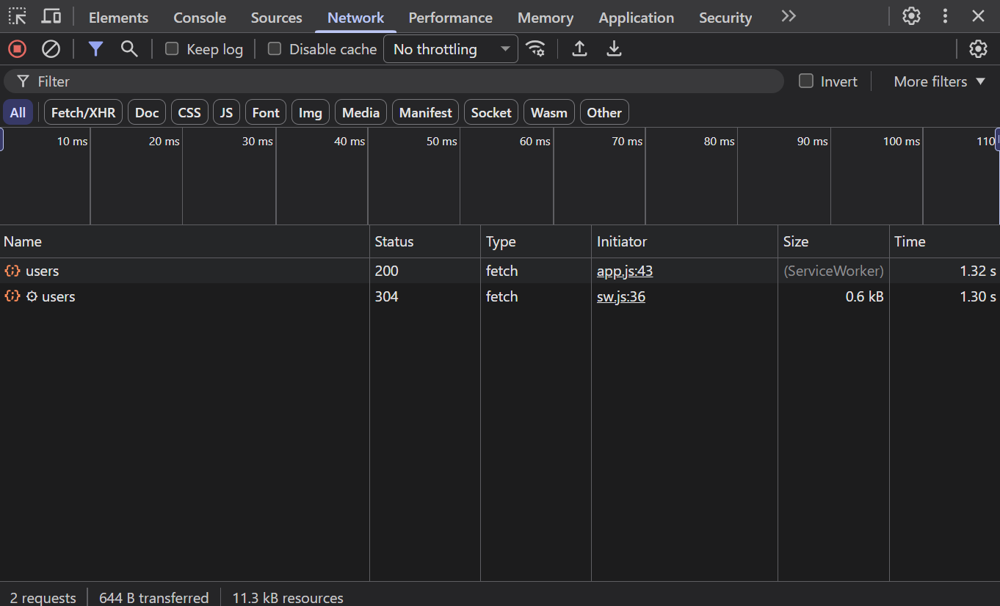

---

## 5. Prueba de funcionamiento offline

1. Abre la app con internet para que se guarde todo en caché.
2. En DevTools → **Network**, marca **Offline** (o desconecta el Wi-Fi).
3. Recarga la página: el App Shell y el catálogo siguen apareciendo y el indicador cambia a **Sin conexión**.

> 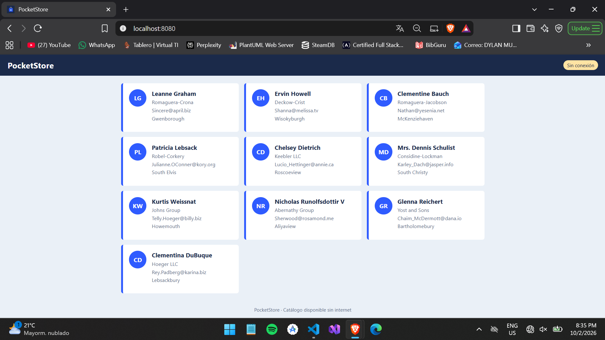

---

## 6. Instalación como app

Con el manifiesto y el Service Worker válidos, el navegador ofrece instalar la app desde el icono de la barra de direcciones (Chrome/Edge) o desde *Agregar a pantalla de inicio* en el móvil.

> 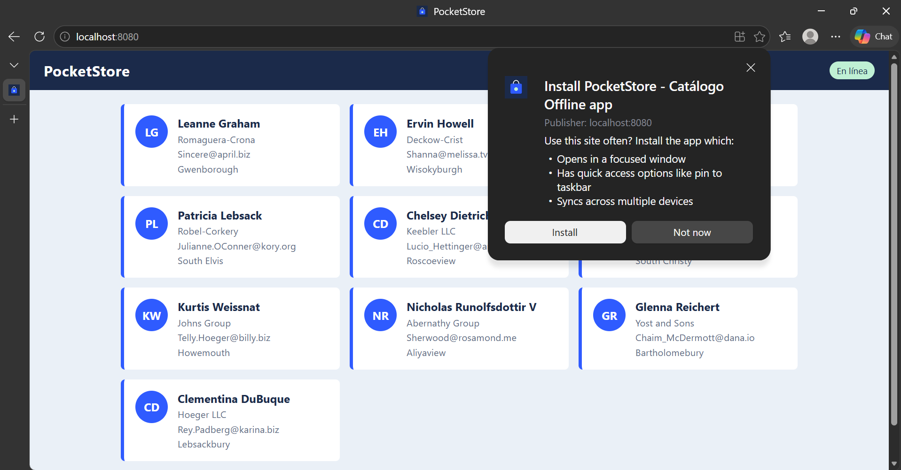

> 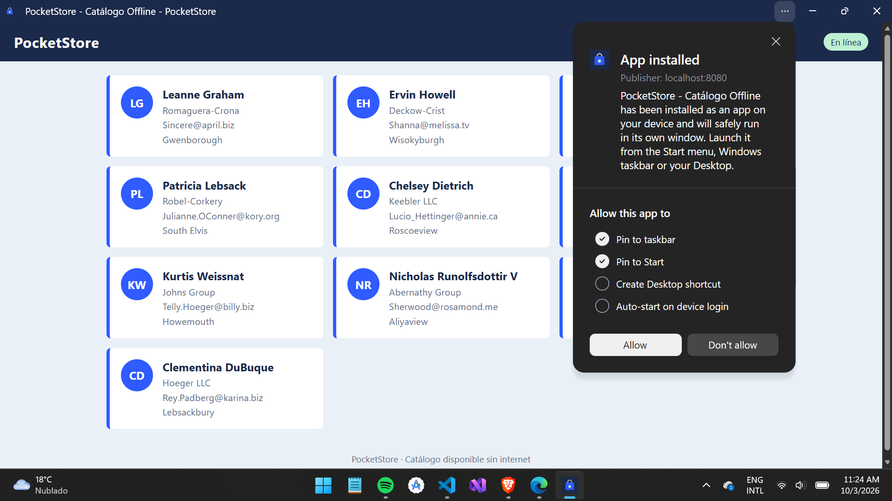
